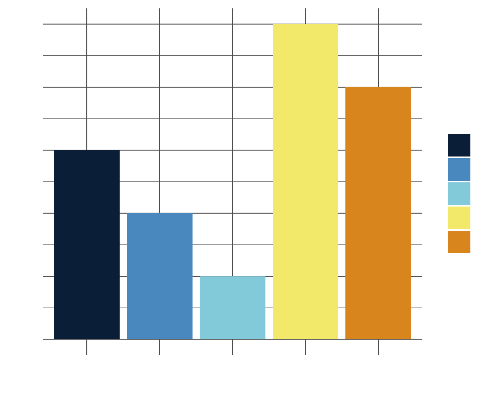
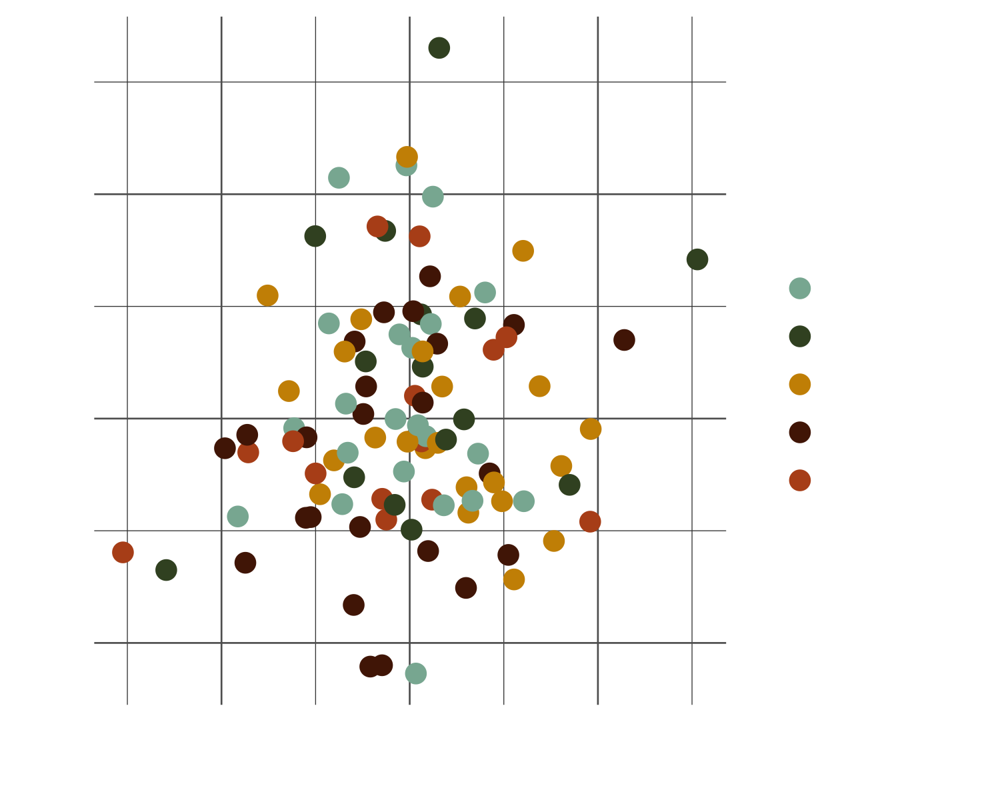
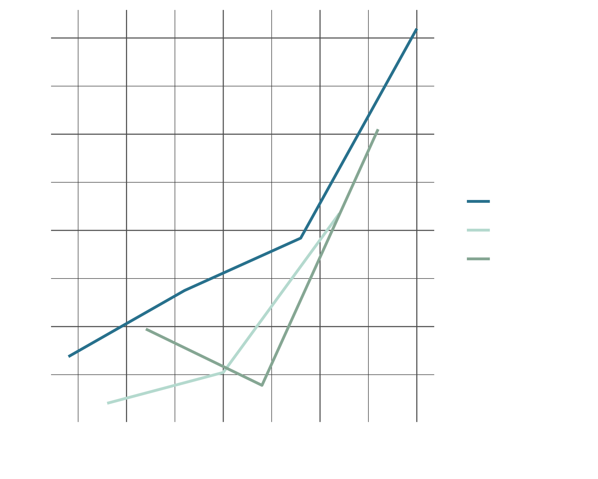

# vangogh 

[](https://CRAN.R-project.org/package=vangogh)
[](LICENSE)
[](https://lifecycle.r-lib.org/articles/stages.html#stable)
[](https://cran.r-project.org/package=vangogh)

An R package for painterly colour palettes inspired by Vincent van Gogh's artworks. The `vangogh` package provides ggplot2-compatible colour palettes derived from the artist's most iconic paintings, with tools for accessibility, visualisation, and data export.

## Installation
Install the released version from CRAN:

```r
install.packages("vangogh")
```

## Quick Start

### Basic Palette Usage

```r
library(vangogh)

# View available palettes
names(vangogh_palettes)

# Preview a palette
viz_palette("StarryNight")

# Get colours from a palette
vangogh_palette("StarryNight")

# Get palette as data frame
vangogh_colors()

# Use specific number of colours
vangogh_palette("Irises", n = 3)

# Generate continuous palette
vangogh_palette("SelfPortrait", type = "continuous", n = 10)

# Use with base R plotting
plot(1:10, col = vangogh_palette("SelfPortrait"), pch = 19, cex = 2)

# Use with ggplot2
library(ggplot2)
ggplot(iris, aes(Sepal.Length, Sepal.Width, color = Species)) +
  geom_point(size = 4) +
  scale_color_vangogh("StarryNight")
```

## Available Palettes

| StarryNight | StarryRhone | SelfPortrait | CafeTerrace | Eglise |
|---|---|---|---|---|
| <br> | <br> | <br> | <br> | <br> |

| Irises | SunflowersMunich | SunflowersLondon | Rest | Bedroom |
|---|---|---|---|---|
| <br> | <br> | <br> | <br> | <br> |

| CafeDeNuit | Chaise | Shoes | Landscape | Cypresses |
|---|---|---|---|---|
| <br> | <br> | <br> | <br> | <br> |

## Essential Functions

### ggplot2 Integration

```r
# Colour scale for categorical data
ggplot(iris, aes(x = Sepal.Length, y = Sepal.Width, color = Species)) +
  geom_point(size = 3) +
  scale_color_vangogh("StarryNight")

# Fill scale for categorical data
ggplot(mpg, aes(x = class, fill = drv)) +
  geom_bar(position = "dodge") +
  scale_fill_vangogh("CafeTerrace")

# Continuous fill scale
ggplot(faithfuld, aes(waiting, eruptions, fill = density)) +
  geom_tile() +
  scale_fill_vangogh("Irises", type = "continuous")
```

### Van Gogh Themes

Apply artistic themes to your plots:

```r
# Available theme variants: "classic", "light", "dark", "sketch"
ggplot(iris, aes(Sepal.Length, Sepal.Width, color = Species)) +
  geom_point(size = 4) +
  scale_color_vangogh("Irises") +
  theme_vangogh("classic")

ggplot(mtcars, aes(wt, mpg)) +
  geom_point(size = 3, color = "#F4A460") +
  theme_vangogh("sketch")
```

### Feature Gallery

A few example plots using Van Gogh palettes.

#### StarryNight - geombar() Example

<div style="text-align: center; margin-bottom: 30px;">
  
  <pre><code>df1 <- data.frame(x = letters[1:5], y = sample(1:5))
ggplot(df1, aes(x, y, fill = x)) +
  geom_bar(stat = "identity") +
  scale_fill_vangogh("StarryNight") +
  theme_minimal()</code></pre>
</div>

#### SunflowersMunich - geom_point() Example

<div style="text-align: center; margin-bottom: 30px;">
  
  <pre><code>df2 <- data.frame(
  x = rnorm(100),
  y = rnorm(100),
  group = sample(1:5, 100, replace = TRUE))
ggplot(df2, aes(x, y, color = factor(group))) +
  geom_point(size = 3) +
  scale_color_vangogh("SunflowersMunich") +
  theme_minimal()</code></pre>
</div>


#### SelfPortrait - geom_line() Example

<div style="text-align: center; margin-bottom: 30px;">
  
  <pre><code>df3 <- data.frame(
  x = 1:10,
  y = cumsum(rnorm(10)),
  group = rep(1:3, length.out = 10))
ggplot(df3, aes(x, y, color = factor(group))) +
  geom_line(linewidth = 1.2) +
  scale_color_vangogh("SelfPortrait") +
  theme_minimal()</code></pre>
</div>

## Advanced Features

### Palette Analysis and Accessibility

Analyse palettes with optional colour space metadata:

```r
# Basic palette information
vangogh_palette_info()

# With HCL colour space data
vangogh_palette_info(add_metadata = TRUE)

# Check accessibility across colour vision types
check_palette("StarryNight")
```

### Palette Comparison and Selection

```r
# Compare multiple palettes side-by-side
compare_palettes(c("StarryNight", "SelfPortrait", "Irises"))

# Get palette suggestions based on number of colours needed
vangogh_suggest(n = 3)

# Get all palette data as a tidy data frame
all_colors <- vangogh_colors(add_metadata = TRUE)
```

### Data Export

Export palettes for use in other applications:

```r
# Export to JSON
vangogh_export("my_palettes.json", format = "json", add_metadata = TRUE)

# Export to CSV
vangogh_export("my_palettes.csv", format = "csv")
```

### Colour Vision Deficiency (CVD) Assessment

The `vangogh` package includes comprehensive tools to evaluate palette accessibility for users with colour blindness. All CVD simulations use the actively maintained `colorspace` package.

#### Check Individual Palettes

Simulate how palettes appear under different types of colour vision deficiency:

```r
# Check a single palette with visual simulation
check_palette("StarryNight")

# Visualise with CVD simulation
viz_palette("Irises", colorblind = TRUE)

# Compare palettes with CVD simulation
compare_palettes(c("StarryNight", "SelfPortrait"), colorblind = TRUE)
```

#### Comprehensive CVD Analysis

Get quantitative accessibility scores:

```r
# Analyse a single palette
check_vangogh_cvd("StarryNight")

# Batch check all palettes
cvd_results <- check_all_vangogh_cvd()

# Filter for CVD-safe palettes (score >= 70)
safe_palettes <- get_cvd_safe_palettes(threshold = 70)

# View pre-computed CVD scores (no colorspace required)
data(vangogh_cvd_scores)
head(vangogh_cvd_scores)
```

#### CVD Reporting Tools

Generate accessibility reports and badges:

```r
# Get palette info with CVD scores
vangogh_palette_info_with_cvd()

# Print markdown badge for a palette
print_cvd_badge("StarryNight")

# Create summary table of all palettes
summarize_cvd_accessibility()
```

#### Understanding CVD Scores

CVD assessment uses **CIELAB colour space** for perceptually uniform distance calculations:

- **Score ≥ 70**: Excellent accessibility
- **Score 50-69**: Good accessibility  
- **Score 30-49**: Fair accessibility
- **Score < 30**: Poor accessibility

The package evaluates three types of colour vision deficiency:
- **Deuteranopia** (red-green, most common)
- **Protanopia** (red-green)
- **Tritanopia** (blue-yellow, rare)

#### Pre-computed Data

Access CVD scores without installing `colorspace`:

```r
# Load pre-computed CVD scores dataset
data(vangogh_cvd_scores)

# Filter by accessibility level
excellent_palettes <- subset(vangogh_cvd_scores, 
                              min_cvd_score >= 70)
```

## Function Reference

| Function | Description |
|----------|-------------|
| `vangogh_palette()` | Extract colours from a Van Gogh palette |
| `vangogh_palettes` | List of all available palettes |
| `scale_color_vangogh()` | ggplot2 colour scale |
| `scale_fill_vangogh()` | ggplot2 fill scale |
| `theme_vangogh()` | Van Gogh-inspired ggplot2 themes |
| `viz_palette()` | Visualise a palette |
| `check_palette()` | Comprehensive accessibility check |
| `compare_palettes()` | Side-by-side palette comparison |
| `vangogh_suggest()` | Get palette recommendations |
| `vangogh_colors()` | Export all palettes as tidy data |
| `vangogh_export()` | Export palettes to JSON or CSV |

## Package Philosophy

Van Gogh's use of colour was revolutionary, employing vivid hues and bold contrasts to convey emotion and movement. This package aims to bring that same artistic sensibility to data visualisation, while maintaining the technical rigor required for clear, accessible communication of information.

Each palette contains five carefully selected colours derived from the original paintings, balancing aesthetic appeal with practical considerations for data visualisation.

## License

MIT License. See [LICENSE](LICENSE) file for details.

## Contributing

Want to contribute? Great! You can:

- Report bugs or suggest features via [GitHub Issues](https://github.com/cherylisabella/vangogh/issues)  
- Submit pull requests for improvements
- Add new Van Gogh palettes with proper documentation