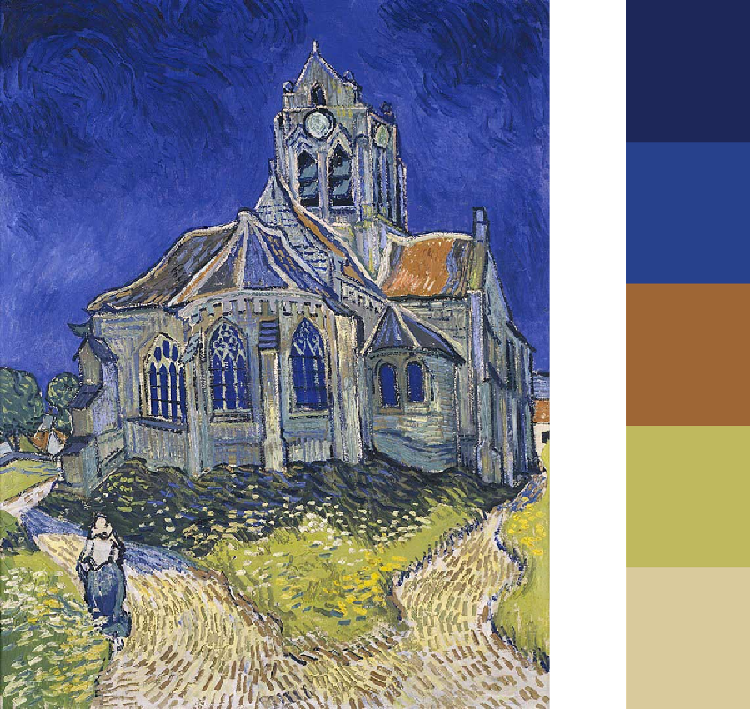

# vangogh 

[](https://CRAN.R-project.org/package=vangogh)
[](LICENSE)
[](https://lifecycle.r-lib.org/articles/stages.html#stable)
[](https://cran.r-project.org/package=vangogh)

An R package for painterly colour palettes inspired by Vincent van Gogh's artworks. The `vangogh` package provides ggplot2-compatible colour palettes derived from the artist's most iconic paintings, with tools for accessibility, visualisation, and data export.

## Installation

You can install the development version from GitHub:

```r
install.packages("remotes")
remotes::install_github("cherylisabella/vangogh")
```

## Quick Start

```r
library(vangogh)

# View available palettes
names(vangogh_palettes)

# Get colours from a palette
vangogh_palette("StarryNight")

# Use with base R plotting
plot(1:10, col = vangogh_palette("SelfPortrait"), pch = 19, cex = 2)

# Use with ggplot2
library(ggplot2)
ggplot(iris, aes(Sepal.Length, Sepal.Width, color = Species)) +
  geom_point(size = 4) +
  scale_color_vangogh("StarryNight")
```

## Available Palettes

### The Starry Night (1889)


```r
vangogh_palette("StarryNight")
```

### Starry Night Over the Rhône / La Nuit étoilée (1888)


```r
vangogh_palette("StarryRhone")
```

### Self-Portrait (1889)


```r
vangogh_palette("SelfPortrait")
```

### Café Terrace at Night (1888)


```r
vangogh_palette("CafeTerrace")
```

### The Church at Auvers (1890)



```r
vangogh_palette("Eglise")
```

### Irises / Les Iris (1889)


```r
vangogh_palette("Irises")
```

### Sunflowers - Munich version (1888)


```r
vangogh_palette("SunflowersLondon")
```

### Sunflowers - London version (1888)


```r
vangogh_palette("SunflowersLondon")
```

### Noon – Rest from Work (1889-1890)


```r
vangogh_palette("Rest")
```

### Bedroom in Arles / Slaapkamer te Arles (1888)


```r
vangogh_palette("Bedroom")
```

### The Night Café / Le Café de nuit (1888)


```r
vangogh_palette("CafeDeNuit")
```

### Van Gogh’s Chair (1888)


```r
vangogh_palette("Chaise")
```

### Shoes (1886)


```r
vangogh_palette("Shoes")
```

### Landscape with Houses (1890)


```r
vangogh_palette("Landscape")
```

### Wheat Field with Cypresses (1889)


```r
vangogh_palette("Cypresses")
```


## Essential Functions

### Basic Palette Usage

```r
# Get a complete palette
colors <- vangogh_palette("StarryNight")

# Use specific number of colors
vangogh_palette("Irises", n = 3)

# Generate continuous palette
vangogh_palette("SelfPortrait", type = "continuous", n = 10)
```

### ggplot2 Integration

```r
# Color scale for categorical data
ggplot(iris, aes(x = Sepal.Length, y = Sepal.Width, color = Species)) +
  geom_point(size = 3) +
  scale_color_vangogh("StarryNight")

# Fill scale for categorical data
ggplot(mpg, aes(x = class, fill = drv)) +
  geom_bar(position = "dodge") +
  scale_fill_vangogh("CafeTerrace")

# Continuous fill scale
ggplot(faithfuld, aes(waiting, eruptions, fill = density)) +
  geom_tile() +
  scale_fill_vangogh("Irises", type = "continuous")
```

### Data Exploration

```r
# See all available palettes
names(vangogh_palettes)

# Preview a palette
viz_palette("StarryNight")

# Get palette as data frame
vangogh_colors()
```

## Advanced Features

### Palette Analysis and Accessibility

Analyse palettes with optional colour space metadata:

```r
# Basic palette information
vangogh_palette_info()

# With HCL colour space data
vangogh_palette_info(add_metadata = TRUE)

# Visualise with colourblind simulation
viz_palette("StarryNight", colorblind = TRUE)

# Check accessibility across color vision types
check_palette("StarryNight")
```

### Palette Comparison and Selection

```r
# Compare multiple palettes side-by-side
compare_palettes(c("StarryNight", "SelfPortrait", "Irises"))

# Get palette suggestions based on number of colours needed
vangogh_suggest(n = 3)

# Get all palette data as a tidy data frame
all_colors <- vangogh_colors(add_metadata = TRUE)
```

### Data Export

Export palettes for use in other applications:

```r
# Export to JSON
vangogh_export("my_palettes.json", format = "json", add_metadata = TRUE)

# Export to CSV
vangogh_export("my_palettes.csv", format = "csv")
```

## ggplot2 Integration

### Colour and Fill Scales

```r
ggplot(mpg, aes(displ, hwy, color = class)) +
  geom_point(size = 3) +
  scale_color_vangogh("StarryNight")

ggplot(mpg, aes(class, fill = drv)) +
  geom_bar() +
  scale_fill_vangogh("CafeTerrace")
```

### Continuous Palettes

```r
ggplot(faithfuld, aes(waiting, eruptions, fill = density)) +
  geom_tile() +
  scale_fill_vangogh("StarryNight", type = "continuous")
```

### Van Gogh Themes

Apply artistic themes to your plots:

```r
# Available theme variants: "classic", "light", "dark", "sketch"
ggplot(iris, aes(Sepal.Length, Sepal.Width, color = Species)) +
  geom_point(size = 4) +
  scale_color_vangogh("Irises") +
  theme_vangogh("classic")

ggplot(mtcars, aes(wt, mpg)) +
  geom_point(size = 3, color = "#F4A460") +
  theme_vangogh("sketch")
```

## Function Reference

| Function | Description |
|----------|-------------|
| `vangogh_palette()` | Extract colours from a Van Gogh palette |
| `vangogh_palettes` | List of all available palettes |
| `scale_color_vangogh()` | ggplot2 colour scale |
| `scale_fill_vangogh()` | ggplot2 fill scale |
| `theme_vangogh()` | Van Gogh-inspired ggplot2 themes |
| `viz_palette()` | Visualise a palette with optional colourblind simulation |
| `check_palette()` | Comprehensive accessibility check |
| `compare_palettes()` | Side-by-side palette comparison |
| `vangogh_suggest()` | Get palette recommendations |
| `vangogh_colors()` | Export all palettes as tidy data |
| `vangogh_export()` | Export palettes to JSON or CSV |

## Package Philosophy

Van Gogh's use of colour was revolutionary, employing vivid hues and bold contrasts to convey emotion and movement. This package aims to bring that same artistic sensibility to data visualisation, while maintaining the technical rigor required for clear, accessible communication of information.

Each palette contains five carefully selected colours derived from the original paintings, balancing aesthetic appeal with practical considerations for data visualisation, including colourblind accessibility.

## License

MIT License. See [LICENSE](LICENSE) file for details.

## Citation

To cite the vangogh package in publications, please use:

```
Lim, C. I. (2022). vangogh: Vincent van Gogh Colour Palette Generator. 
R package version 0.1.2. https://github.com/cherylisabella/vangogh
```

## Contributing

Want to contribute? Great! You can:
- Report bugs or suggest features via [GitHub Issues](https://github.com/cherylisabella/vangogh/issues)  
- Submit pull requests for improvements
- Add new Van Gogh palettes with proper documentation
